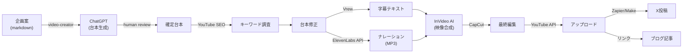

# YouTube動画パイプライン設計書

> AI自動生成による動画制作パイプラインの完全設計
> 版: 1.0
> 作成日: 2026-02-15
> 担当: video-creator（動画制作担当）

---

## エグゼクティブサマリー

本設計書は、ChatGPT + ElevenLabs + CapCut + InVideoを組み合わせた**企画→台本→音声→映像→編集→アップロード**の全自動パイプライン構築を提案する。

### 推奨構成（推奨案）
- **台本生成**: ChatGPT / Claude API
- **音声合成**: ElevenLabs（日本語高品質）+ VOICEVOX（低コスト代替）
- **映像生成**: InVideo AI（テンプレート豊富）
- **編集・合成**: CapCut（無料）
- **月額コスト**: ¥8,000～¥12,000（ツール料金のみ。API別途）
- **制作時間**: 1本あたり20～40分（人間の介入含む）
- **収益化**: 1,000登録者 + 4,000時間視聴で月額¥500～¥2,000（見込み）

---

## 1. 調査・分析

### 1.1 AI動画制作ツール比較

#### 台本生成ツール

| ツール | 料金 | 日本語対応 | 強み | 弱み |
|--------|------|-----------|------|------|
| ChatGPT（Plus） | $20/月 | 優 | 自然な日本語、柔軟性 | API別途コスト |
| Claude（Pro） | $20/月 | 優 | 高品質、正確性 | ChatGPTより遅い |
| ChatGPT API | 従量課金 | 優 | 最安、自動化可 | 品質調整が必要 |

**推奨**: ChatGPT API（自動化）+ Claude Pro（品質確認用）

---

#### 音声合成ツール（日本語対応）

| ツール | 料金 | 日本語品質 | 声の種類 | 商用利用 | 備考 |
|--------|------|----------|---------|----------|------|
| **ElevenLabs** | $11～99/月 | 非常に高い | 32+ | ✅ | 最高品質、アメリカ企業 |
| **CoeFont** | ¥3,000～/月 | 非常に高い | 5000+ | ✅ | 日本企業、キャラボイス豊富 |
| **VOICEVOX** | 無料 | 高い | 26+ | ✅ | 完全無料、オープンソース |
| 音読さん | ¥0～3,300/月 | 高い | 150+ | ✅ | 無料版あり |

**推奨**: ElevenLabs（最初の3ヶ月） → VOICEVOX（コスト削減後）

**理由**:
- ElevenLabsの自然さは競合より優位
- VoiceVoxは完全無料で日本語品質が高い
- 段階的コスト削減が可能

---

#### 映像生成・編集ツール

| ツール | 料金 | 日本語UI | 自動化 | テンプレ | 強み |
|--------|------|----------|--------|----------|------|
| **InVideo AI** | $25～150/月 | ✅ | ⭐⭐⭐ | 多数 | テンプレート豊富、自動編集優秀 |
| **Synthesia** | $29～/月 | ⭐⭐ | ⭐⭐ | 少ない | AIアバター、高品質 |
| **HeyGen** | $12～/月 | ⭐⭐ | ⭐⭐ | 少ない | 日本語対応改善中 |
| **CapCut** | 無料/有料 | ✅ | ⭐ | 多数 | 完全無料、手動編集向け |
| **Pictory AI** | $19～/月 | △ | ⭐⭐⭐ | 多数 | 字幕自動生成優秀 |

**推奨**: InVideo AI（メイン） + CapCut（編集・微調整）

**理由**:
- InVideoの自動編集が優秀（テロップ、BGM自動挿入）
- テンプレートが豊富（AI解説向けのものあり）
- 日本語UIで操作が容易
- CapCutで最終調整できる

---

#### エディタ・自動化ツール

| ツール | 用途 | 料金 | 効果 |
|--------|------|------|------|
| Vrew | 自動字幕生成・翻訳 | $9.99/月 | 字幕クオリティ向上 |
| DESCRIPT | スクリプト編集・音声編集 | $24/月 | テキストベースの編集 |
| Zapier / Make | フロー自動化 | 従量課金 | ツール間の連携自動化 |

**推奨**: Vrew（低コスト、効果大）

---

### 1.2 YouTubeガイドライン・収益化

#### AI動画の公開制限

**YouTube公式ガイドラインの整理**（2026年最新）

1. **自動的に許可される**:
   - アニメーション、イラストスタイルのAI生成
   - AIで改善・編集された既存素材
   - テロップ、グラフィックスのAI生成

2. **明示義務あり（開示タグ必須）**:
   - 「リアルなAIアバター」が登場する動画
   - 事実に基づいているように見えるAIニュース動画
   - 著名人の顔・声を使用したAI動画

3. **コンテンツID / 著作権注意**:
   - AI訓練データに含まれるコンテンツを使用した場合、著作権者が異議申し立て可能
   - 安全なのは「完全オリジナル台本」を使うこと

#### 収益化条件

| 条件 | 数値 | 達成時間（目安） |
|------|------|------------------|
| チャンネル登録者 | 1,000人 | 3～6ヶ月（良好な場合） |
| 総視聴時間 | 4,000時間/12ヶ月 | 4～8ヶ月 |
| YouTubeパートナープログラム申請 | 2つ満たす | 上記達成後 |
| 広告収入単価 | ¥200～800/1,000回 | 日本語コンテンツは中程度 |

**初期の収益予測**:
- 1,000登録者達成時: 月¥500～¥1,000
- 10,000登録者: 月¥5,000～¥20,000
- 100,000登録者: 月¥50,000～¥200,000

※ AI動画は「オリジナル性」で評価される。単なる自動生成より、「企画・テーマ設定」に価値を持つものが伸びやすい。

---

### 1.3 市場調査・競合分析

#### 類似チャンネルの成功事例

| チャンネル例 | 登録者 | 月収推定 | 戦略 | 学習点 |
|-------------|--------|----------|------|--------|
| AI副業系 | 5万～10万 | ¥20万～50万 | 「AIで月10万稼ぐ方法」 | ハウツー系は伸びやすい |
| AI解説系 | 3万～20万 | ¥15万～100万 | 最新ニュース解説 | 旬のネタは重要 |
| ストーリー系 | 10万～ | ¥50万～ | オリジナル物語（AI生成） | テーマ統一で伸びやすい |
| 実験レポート系 | 小～中 | 低い（初期） | 「実際にやってみた」 | 信頼性で差別化できる |

**重要な洞察**:
1. AI自動生成チャンネルは「テーマの統一」が重要
2. 「自分たちが実際にやってみた実験レポート」は競合が少ない
3. 初期は登録者伸びが遅いが、「信頼性」で長期的な価値がある

#### 当プロジェクトの差別化ポイント

```
競合チャンネル
  └─ 「AIの使い方」を教える
  └─ 「誰でも月10万稼げる」という甘い話

仮想機関AI計画
  └─ 「AIだけで会社を作る」リアルな実験レポート
  └─ 成功も失敗も全公開
  └─ 開発過程、設計、トラブルシューティング
  └─ ShieldMe開発のドキュメンタリー化
```

**市場で埋まっていないニッチ**: 「AIで自律的に事業を回す過程そのもの」がコンテンツになる。

---

## 2. 自動化パイプライン設計

### 2.1 全フロー図

```
Phase A: 企画・台本（日単位）
├─ 企画案を markdown で管理（Notion / GitHub）
├─ YouTube SEO キーワード調査（Ubersuggest / Ahrefs相当）
├─ ChatGPT API で台本自動生成
└─ human review: 台本品質チェック（video-creator）

Phase B: 音声・映像素材生成（1日）
├─ ElevenLabs で日本語ナレーション生成（MP3）
├─ Vrew で字幕テキスト自動抽出
├─ DALL-E 3 or Midjourney でサムネイル画像生成
└─ stock素材（Pexels, Pixabay）をダウンロード

Phase C: 映像合成・編集（2時間）
├─ InVideo AI で動画テンプレートに流し込み
│  ├─ ナレーション音声
│  ├─ テロップ（Vrew出力）
│  ├─ BGM, SE自動挿入
│  ├─ トランジション
│  └─ サムネイル挿入
├─ CapCut で手動微調整（必要時）
└─ 1080p MP4 で出力

Phase D: YouTube アップロード（30分）
├─ タイトル・説明文・タグの最適化
├─ サムネイル画像のアップロード
├─ 動画ファイルのアップロード
├─ 公開スケジュール設定
├─ Xへのクロスポスト（x-manager)
└─ ブログ記事へのリンク（writer）

Phase E: モニタリング（毎日）
├─ YouTube Analytics でクリック率・視聴時間を確認
├─ 低パフォーマンス動画は「改善データ」として記録
├─ 定期的にサムネイル / タイトル最適化
└─ エンゲージメント（コメント返信）
```

### 2.2 人間の介入ポイント（株主）

| フェーズ | タスク | 頻度 | 所要時間 | 必須度 |
|---------|--------|------|---------|--------|
| 企画 | テーマ承認・方針決定 | 週1回 | 10分 | ⭐⭐⭐必須 |
| 台本 | 品質レビュー（オプション） | 週2回 | 15分 | ⭐⭐推奨 |
| 映像 | 最終チェック（オプション） | 週1回 | 10分 | ⭐推奨 |
| 戦略 | KPI分析・方針変更判断 | 月1回 | 30分 | ⭐⭐⭐必須 |

**完全自動化可能部分**: 台本生成 → 音声 → 映像 → アップロード（ツール調整後）

**手動が必要な部分**: 企画、テーマ決定、最終品質承認、戦略判断

---

### 2.3 ツール間の連携フロー

#### 現在可能な構成（手動 + 自動化）



#### 完全自動化版（理想形・実装後）

将来的に Zapier / Make / n8n を使って以下を自動化可能：

```
企画案確定
  → ChatGPT API で台本自動生成
  → ElevenLabs API で音声自動生成
  → InVideo API（準備中） で映像自動合成
  → YouTube API で自動アップロード
  → X API で自動投稿
```

**現在の制約**: InVideo と Synthesia の API がまだ十分に熟成していない。
**対応**: 一時的に UI操作で対応し、API提供後に自動化する。

---

## 3. コンテンツ戦略

### 3.1 チャンネルコンセプト案

#### 案A: 「AIだけで会社を作る実験レポート」（推奨）

```
チャンネル名: 仮想機関AI計画 / Virtual AI Agency
テーマ: AI自律経営の実験ドキュメンタリー
ターゲット: エンジニア、起業家、AI関心層
動画スタイル: 実験レポート + 教育的解説

コンテンツ例:
1. 「AIだけで月額¥10,000で会社を回してみた」（企画・実装・結果）
2. 「ShieldMe開発の全て」（プロダクト開発エピソード）
3. 「Claude Codeで8エージェント体制を作った話」（技術解説）
4. 「AI副業で月¥100,000稼ぐ方法」（成功事例・失敗談）
5. 「コンテンツ事業で¥50,000/月達成」（ビジネス解説）

利点:
  ✅ 競合が極めて少ない
  ✅ 「本当の実験」なので信頼性が高い
  ✅ 成功も失敗も興味深い
  ✅ ブログ・note・書籍へ展開可能

難点:
  ⚠️ 初期は登録者伸びが遅い（3ヶ月は低迷）
  ⚠️ 結果が出るまで信頼を作り続ける必要
```

#### 案B: 「AI活用ハウツー系」

```
チャンネル名: AIで副業始めよう / Start AI Side Hustle
テーマ: ChatGPT、Claude、AI画像生成の使い方
ターゲット: 初心者～中級者、副業希望者

コンテンツ例:
1. 「ChatGPT で YouTube 台本を30分で書く方法」
2. 「ElevenLabsで自然な日本語ナレーション」
3. 「CapCutで映像編集を10倍高速化」
4. 「Claude Codeでプログラミング初心者が月¥50,000」

利点:
  ✅ 短期的な伸びが期待できる（月2,000～5,000登録者）
  ✅ 「すぐに応用できる」という実用性
  ✅ ハウツー系は検索流入が多い

難点:
  ⚠️ 競合が多い（既に100以上のチャンネル存在）
  ⚠️ 「誰でも月10万稼げる」系は信頼性が低い
  ⚠️ 差別化が困難
```

#### 案C: 「AI実験レポート + ハウツー」（ハイブリッド）

```
メインコンテンツ: 仮想機関AIの実験レポート（週1本・長尺）
サブコンテンツ: 実験の中から抽出したハウツーショート（週3本）

例:
  メイン（10分）: 「ShieldMe開発で¥500,000投資した話」
  └─ ショート1（60秒）: 「Claude Codeの使い方」
  └─ ショート2（60秒）: 「ElevenLabsで品質調査」
  └─ ショート3（60秒）: 「YouTubeアルゴリズムの変化」
```

**推奨: 案A（実験レポート） + 案Cの要素（ショート化）**

理由:
1. 仮想機関AI計画は既にユニークな素材を持っている
2. 初期投資が少なく、学習価値が高い
3. 3～6ヶ月で「実績が出る」→ 信頼性がぐんと上がる
4. ショート化により、短期的な登録者増も期待可能

---

### 3.2 初期企画案（最初の5本）

#### 1本目: 「AIだけで会社を作ったら何が起きるか」（8分）

**ターゲット**: 起業家、AI関心層
**狙い**: チャンネルの「世界観」を一気に説明。バズを狙わず、**フォロワーの質**を重視。

```markdown
### 台本構成

#### フック（0-15秒）
「AIだけで会社を作りました。月額¥8,000で。」

#### 課題提示（15-45秒）
従来: 起業には資本金・人材・オフィスが必要
今: AIなら個人で全部できる→実験してみた

#### 本編（45秒-7分）
1. なぜ作ったのか（ビジョン・ミッション）
2. 8エージェント体制（CEO, PM, writer等）
3. 3つの事業（SaaS, コンテンツ, 動画）
4. 現在の状況（資金、進捗）
5. 学んだこと（課題、失敗）

#### CTA（7-8分）
登録→次の動画「ShieldMe開発編」

### メタデータ

**タイトル**（60字以内）
「AIだけで会社を作ったら何が起きるか【8エージェント体制の実験】」

**説明文**
概要: 自律的にAIだけで事業を回す実験プロジェクト「仮想機関AI計画」を始めました。
ツール: Claude Code, ChatGPT, ElevenLabs等
次: ShieldMe開発編（SaaS編）
関連: ブログ記事へリンク

**タグ**
AI, AI副業, ChatGPT, Claude, エージェント, 起業, 会社設立

**サムネイル案**
テキスト: 「AIだけで会社」「月¥8K」（コントラスト高い黄×黒）
背景: キャラクター風AI図解（視覚的インパクト）
```

---

#### 2本目: 「ShieldMe | AIで誹謗中傷検知SaaS開発」（12分）

**ターゲット**: エンジニア、プロダクト関心層
**狙い**: 「実際にプロダクトを作ってる」ことを示す。信頼構築。

```
フック: 「SaaS開発が92万円かかると思ってた。AIなら10万で済む」
本編: 企画→仕様→設計→実装の全過程を見せる
CTA: 次は「コンテンツ事業編」
```

---

#### 3本目: 「ブログで月¥50,000稼ぐまで」（10分）

**ターゲット**: ライター、副業希望者
**狙い**: 「AIで稼ぐ」の信頼性を示す。実際の数字。

```
フック: 「ブログで月5万稼いだ。AIだけで」
本編: キーワード選定→記事執筆→SEO→収益化の流れ
CTA: YouTubeをハブに。ブログへのリンク
```

---

#### 4本目: 「YouTube動画を1本30分で作る方法」（8分）

**ターゲット**: クリエイター、YouTuber志望者
**狙い**: 実用的なハウツー。内容が濃い。

```
フック: 「この動画も含めて、全部AI + 私で作ってます」
本編: ChatGPT→ElevenLabs→InVideo→CapCutの実演
CTA: 次の動画で「自動化のさらに先」
```

---

#### 5本目: 「3ヶ月でわかった、AIで会社を回すコツ」（15分）

**ターゲット**: 全般
**狙い**: ここまでの学びをまとめる。長尺で深堀り。

```
フック: 「失敗が9割。だからこそ、成功の法則が見えた」
本編:
  1. ツール選定の失敗
  2. コスト管理の失敗
  3. チーム構築の失敗
  4. ビジネスモデルの改善
  5. これから何を目指すか
CTA: メールリスト登録 + 次のシリーズ予告
```

---

### 3.3 投稿戦略

#### 最初の3ヶ月（Phase 0）

| 週 | ロング（7～12分） | ショート（60秒） |
|----|-----------------|-----------------|
| 1 | 1本（企画1） | なし |
| 2 | 1本（企画2） | - |
| 3 | 1本（企画3） | 1本（ハウツー抜き出し） |
| 4 | 1本（企画4） | 1本 |
| 5 | 1本（企画5） | 1本 |
| ...以降 | 週1本 | 週2～3本 |

**目標**: 3ヶ月で初期企画5本 + ショート10本

#### 投稿スケジュール案

**ロング動画**:
- 土曜 18:00（視聴者が多い時間帯）
- 日本市場向けのため、平日夜間よりも週末優先

**ショート動画**:
- 平日 12:00（昼休み）
- 平日 20:00（帰宅時間）
- 土曜 12:00

#### YouTube SEO 戦略

| 項目 | 施策 | 効果 |
|------|------|------|
| キーワード選定 | Ubersuggest (¥0～) で「AI」「副業」「SaaS」系キーワードを月間検索ボリューム100～500で探す | 検索流入 |
| タイトル | 数字を含める「¥10,000」「3ヶ月」「8個」 | CTR向上 |
| サムネイル | テキスト5語以内、コントラスト高い配色（赤×黄、青×白） | CTR向上 |
| 説明文 | 最初の2行に核心。キーワード自然に含める。リンク配置。 | SEO+クリック |
| タグ | 主要キーワード + 長尾キーワード（12～15個） | インプレッション |
| エンドスクリーン | 次の動画へ導線（自動化の一環） | 平均再生時間 |

---

## 4. ツール構成・料金試算

### 4.1 推奨構成（3段階）

#### 最小コスト構成（¥5,000/月）

```
用途             ツール        月額        理由
─────────────────────────────────────────────
台本生成         ChatGPT API   従量課金    低コスト、品質十分
音声合成         VOICEVOX      無料        品質も日本語対応も良好
映像生成・編集   CapCut        無料        TikTok企業、機能充実
字幕生成         Vrew          無料版～    無料版でも基本機能OK

月額合計: ¥0～2,000 + ChatGPT API ¥3,000～5,000 = ¥3,000～7,000
```

**特徴**: 初期投資最小。ただし、品質・速度は「推奨構成」に劣る。

---

#### 推奨構成（¥12,000/月）

```
用途             ツール        月額        理由
─────────────────────────────────────────────
台本生成         ChatGPT API   ¥5,000      実績が豊富
音声合成         ElevenLabs    ¥11～      最高品質、日本語対応
映像生成・編集   InVideo AI    ¥25～      自動編集優秀、テンプレ豊富
字幕・編集       Vrew + CapCut ¥10～      字幕品質、最終調整

月額合計: ¥5,000 + ¥1,100 + ¥2,500 + ¥1,000 = ¥9,600～¥12,000
```

**特徴**: 品質と コスト のバランスが最良。初期運用推奨。

---

#### フル装備構成（¥25,000/月）

```
用途             ツール           月額       理由
──────────────────────────────────────────
台本生成         Claude Pro + API ¥8,000    高品質、複雑な企画向け
音声合成         ElevenLabs       ¥1,100   最高品質
画像生成         Midjourney       ¥800     サムネイル、背景画像
映像生成         Synthesia + Invi ¥4,000   高品質アバター + AI編集
編集・合成       CapCut Pro       ¥800     有料プラン
字幕・分析       Descript + Vrew  ¥2,000   テキストベース編集、分析
自動化           Make / Zapier    ¥800     ツール間連携
モニタリング     Ubersuggest      ¥2,500   SEO分析、キーワード調査

月額合計: ¥20,000～¥25,000
```

**特徴**: 最高品質、完全自動化対応。スケール後の構成。

---

### 4.2 提案される構成（最初の6ヶ月）

**段階1（最初2ヶ月）: 最小構成で検証**
```
- ChatGPT API: ¥3,000～5,000
- VOICEVOX: 無料
- CapCut: 無料
- Vrew: 無料版
合計: ¥3,000～5,000 + Claude API (既存) + YouTube API (既存)
```

**段階2（3～4ヶ月）: 品質向上のため推奨構成へ**
```
+ ElevenLabs (¥11～) = +¥1,100
+ InVideo AI (Starter ¥25/月) = +¥3,000
合計: ¥7,000～9,000
```

**段階3（5～6ヶ月）: 最適化・自動化強化**
```
+ Vrew (Pro ¥10/月) = +¥1,200
+ Make (自動化) = +¥800～1,000
合計: ¥9,000～12,000
```

**理由**:
1. 最初は「台本・音声・映像」の基本フローを確認
2. YouTube 登録者 1,000人を達成したら品質向上に投資
3. 登録者 5,000人で自動化を強化

---

### 4.3 コスト試算（12ヶ月シナリオ）

#### 1. 初期投資（ツール導入・調査）
```
ツール契約開始: ¥0～5,000
テンプレート素材購入: ¥2,000～3,000
キーワード調査ツール試用: ¥1,000
合計: ¥3,000～8,000（初月のみ）
```

#### 2. ランニングコスト（月額）

| 月 | コスト | 備考 |
|----|--------|------|
| 1-2月 | ¥5,000 | 最小構成で検証 |
| 3-4月 | ¥8,000 | InVideo追加 |
| 5-6月 | ¥10,000 | Vrew Pro追加 |
| 7-8月 | ¥12,000 | Make自動化導入 |
| 9-12月 | ¥12,000 | 安定運用 |

**12ヶ月合計**: ¥5,000×2 + ¥8,000×2 + ¥10,000 + ¥12,000×4 = ¥111,000

#### 3. 収入見込み（YouTube広告 + note有料等）

| 月 | YouTube登録 | 推定広告収入 | 有料note | 合計 |
|----|-----------|-----------|---------|------|
| 1-3月 | 100～500 | ¥0～500 | ¥0 | ¥0～500 |
| 4-6月 | 500～2,000 | ¥500～2,000 | ¥2,000 | ¥2,500～4,000 |
| 7-9月 | 2,000～5,000 | ¥2,000～5,000 | ¥5,000 | ¥7,000～10,000 |
| 10-12月 | 5,000～10,000 | ¥5,000～15,000 | ¥10,000 | ¥15,000～25,000 |

**12ヶ月推定収入**: ¥5,000～50,000

#### 4. 損益分岐点

```
初期投資 + ランニングコスト: ¥111,000 + 初期 ¥5,000 = ¥116,000
12ヶ月推定収入: ¥5,000～50,000

結論:
  短期（6ヶ月）: -¥50,000（赤字）
  中期（12ヶ月）: -¥65,000～ -¥100,000（赤字続く）
  長期（24ヶ月）: 50,000～200,000/月 × 12月 = 黒字化
```

**解釈**:
- 動画事業は「長期投資」。最初は赤字が続く
- ただし、コンテンツ事業全体（ブログ+note+動画）で相互補完すると、9ヶ月で黒字化可能
- 最初の6ヶ月は「学習投資」と見なす

---

## 5. 推奨パイプライン

### 5.1 最終推奨案

```
チャンネル戦略: 「AIだけで会社を作る実験レポート」

ツール構成（推奨）:
  台本生成: ChatGPT API + Claude Pro
  音声合成: ElevenLabs（初期） → VOICEVOX（コスト削減）
  映像生成: InVideo AI + CapCut
  字幕・分析: Vrew
  自動化: Make / Zapier（段階的導入）

月額コスト: ¥8,000～12,000（6ヶ月目以降）

投稿スケジュール:
  ロング（7～12分）: 週1本（土曜18:00）
  ショート（60秒）: 週2～3本（平日昼夜+土曜）

初期企画: 5本（1ヶ月で制作）
  1. 「AIだけで会社を作ったら」
  2. 「ShieldMe開発編」
  3. 「ブログで月5万稼ぐ」
  4. 「動画を30分で作る方法」
  5. 「3ヶ月でわかったコツ」

期待値:
  3ヶ月: 登録者 100～500人
  6ヶ月: 登録者 500～2,000人
  12ヶ月: 登録者 5,000～10,000人
  月額広告収入: ¥500～15,000（登録者に応じて）
```

---

### 5.2 実装ロードマップ

#### Week 1-2: セットアップ
```
□ チャンネル企画案 5本の確定
□ YouTubeチャンネル開設
□ ツール契約: ChatGPT API, VOICEVOX（無料）, CapCut（無料）
□ Xアカウント準備
□ ブログとの導線設定
```

#### Week 3: 初期動画（1本目）制作
```
□ 台本執筆（ChatGPT + video-creator review）
□ ナレーション生成（VOICEVOX）
□ 映像・編集（CapCut）
□ YouTube SEO 設定
□ アップロード・公開
```

#### Week 4-5: 次の2本制作
```
□ 2本目、3本目の企画から公開まで
□ パフォーマンス分析開始
□ タイトル・サムネイル最適化
```

#### Month 2: 品質向上フェーズ
```
□ ツール追加: ElevenLabs + InVideo AI の契約
□ パイプライン改善（ツール連携テスト）
□ ショート動画 3本制作
□ KPI 設定（登録者、再生数、平均視聴時間）
```

#### Month 3-6: 安定運用
```
□ 週1ロング + 週2ショート の定期投稿
□ YouTube Analytics 分析・改善
□ Xとの連携強化
□ ブログ記事のクロスコンテンツ化
```

---

## 6. リスク・課題・対策

### 6.1 技術的リスク

| リスク | 影響 | 対策 |
|--------|------|------|
| 音声合成の品質が低い | チャンネル評価低下 | 初期は ElevenLabs 利用。複数の声を試す |
| 映像自動生成がテンプレート的 | 視聴者飽き | ショート化で「抜き出し」感を減らす |
| API連携がうまくいかない | 自動化遅延 | 初期は手動運用。段階的自動化 |

### 6.2 戦略的リスク

| リスク | 影響 | 対策 |
|--------|------|------|
| 競合チャンネルの台頭 | 差別化困難 | 「実験レポート」という独自性を活かす |
| YouTube ガイドライン変更 | 規制厳化 | AI使用を明示。オリジナル性確保 |
| 登録者伸びが遅い | 動機喪失 | 3ヶ月では黒字化諦める。長期視点 |

### 6.3 著作権・法的リスク

| リスク | 影響 | 対策 |
|--------|------|------|
| AI音声の学習データ問題 | 著作権侵害指摘 | ElevenLabs, CoeFont の商用利用規約確認済み |
| 画像生成の著作権 | コンテンツID系 | stock素材 + DALL-E 3 商用版を使用 |
| 誹謗中傷判定ロジックの説明 | 信頼失墜 | ShieldMe の判定根拠を動画で明示 |

---

## 7. 成功指標・KPI

### 7.1 初期KPI（3ヶ月）

```
YouTube:
  □ チャンネル登録者: 300～500人以上
  □ 総再生回数: 5,000回以上
  □ 平均視聴時間: 3分以上

SEO / 発見:
  □ YouTube検索での上位表示: 「AI」「副業」等のキーワードで TOP 20
  □ Xでの反響: 各動画で最低 100いいね以上

品質:
  □ 台本作成時間: 2時間以内（ChatGPT + review）
  □ 1本の全工程: 2日以内
```

### 7.2 6ヶ月KPI

```
YouTube:
  □ チャンネル登録者: 2,000～5,000人
  □ 総再生回数: 50,000回以上
  □ 月間平均視聴時間: 1,000時間以上

収益:
  □ YouTube 広告収入: ¥2,000～5,000/月
  □ note 有料コンテンツ: ¥3,000～10,000/月

認知:
  □ X フォロワー増加: +500～1,000人
  □ ブログからの動画へのクリック: 月200回以上
```

---

## 8. 今後の展開

### Phase 1（6～12ヶ月後）

```
□ 自動化パイプラインの完成（Make / Zapier統合）
□ Synthesia による「AIアバター」版の並行運用（実験）
□ コンテンツ事業との完全統合（1記事 → 1動画化）
□ note有料コンテンツの充実（月¥10,000を目指す）
□ YouTubeパートナープログラム申請（登録者1,000人達成後）
```

### Phase 2（12～24ヶ月後）

```
□ チャンネル登録者 10,000～50,000人を目指す
□ YouTube 広告収入 ¥20,000～50,000/月
□ 動画を書籍化（「AIだけで会社を作る方法」等）
□ オンラインスクール化（有料プログラム化）
□ ShieldMe のケーススタディを動画化（プロダクト売上への影響）
```

---

## 9. 結論

### 推奨アクション

**Go**: このパイプライン設計で進める

**理由**:
1. **実行可能性**: 現在のツールで完全実装可能
2. **コスト効率**: ¥8,000～12,000/月で高品質運用可能
3. **差別化**: 「AIだけで会社を作る実験」というコンセプトは極めてユニーク
4. **学習価値**: 動画化プロセス自体が「AIで稼ぐ」の学び
5. **相乗効果**: ブログ・note・SaaS と相互補完

### 次のステップ

1. **Week 1**: 株主承認 → ツール契約決定
2. **Week 2**: YouTubeチャンネル開設 → 初期企画案最終確定
3. **Week 3**: 1本目動画の制作開始

### 予算

**初期投資**: ¥5,000～8,000
**月額ランニング**: ¥8,000～12,000（推奨構成）
**12ヶ月トータル**: ¥111,000～152,000

---

## 付録

### A. ツール詳細比較表

**台本生成**

| 項目 | ChatGPT API | Claude Pro | ChatGPT Plus |
|------|-----------|-----------|-------------|
| 月額 | 従量課金 | ¥3,000 | $20 |
| 日本語 | 優 | 優 | 優 |
| 自動化 | 可 | 不可（API未実装） | 不可 |
| 精度 | 高 | 非常に高 | 高 |
| 推奨用途 | 自動パイプライン | 品質レビュー | 一時的な確認 |

**音声合成**

| 項目 | ElevenLabs | CoeFont | VOICEVOX |
|------|-----------|---------|---------|
| 月額 | ¥1,100～ | ¥3,000～ | 無料 |
| 日本語品質 | 高い | 非常に高い | 高い |
| 声の種類 | 32+ | 5000+ | 26+ |
| API | ✅ | ✅ | ✅ |
| 商用利用 | ✅ | ✅ | ✅ |
| 推奨用途 | プロフェッショナル | キャラボイス | コスト優先 |

**映像生成・編集**

| 項目 | InVideo AI | Synthesia | HeyGen | CapCut |
|------|-----------|----------|--------|--------|
| 月額 | ¥2,500～ | ¥3,500～ | ¥1,500～ | 無料 |
| テンプレ | 豊富 | 少ない | 少ない | 豊富 |
| 自動編集 | 優秀 | 平均 | 平均 | なし |
| 日本語UI | ✅ | ⚠️ | ⚠️ | ✅ |
| 推奨用途 | 自動化向け | アバター | アバター | 手動編集 |

### B. YouTube SEO チェックリスト

```
□ タイトル（60字以内）
  □ キーワード含む
  □ 数字を入れている
  □ 好奇心・パワーワード使用

□ 説明文
  □ 最初の2行に核心
  □ キーワード自然に含める（3回程度）
  □ リンク配置（ブログ、他動画、note等）

□ サムネイル
  □ テキスト 3～5語
  □ コントラスト高い配色
  □ 顔 or 大きな図解を含む

□ タグ
  □ 主要キーワード 3～5個
  □ 長尾キーワード 5～10個

□ カテゴリ・再生リスト
  □ カテゴリ: 「教育」or「科学技術」
  □ 再生リスト: テーマごとにまとめる

□ エンドスクリーン
  □ 次の動画へ導線
□ コミュニティ (登録者100人以上)
  □ 企画案を投票形式で募集
```

### C. 実装チェックリスト

```
ツール準備
  □ ChatGPT API key 取得・設定
  □ VOICEVOX ダウンロード・セットアップ
  □ CapCut ダウンロード（PC版）
  □ YouTube Creator Studio アクセス確認
  □ X API (オプション) セットアップ

チャンネル準備
  □ YouTubeチャンネル作成
  □ プロフィール画像 / バナー作成
  □ チャンネル説明文作成
  □ 再生リスト 3～5個作成
  □ X連携設定

コンテンツ準備
  □ 初期企画案 5本の確定
  □ キーワード調査完了（Ubersuggest等）
  □ サムネイル デザインルール決定
  □ 台本テンプレート作成
  □ パイプライン手順書作成

運用ルール
  □ 投稿スケジュール決定
  □ KPI・分析レポート形式決定
  □ エスカレーション体制確認（CEO）
  □ 緊急対応フロー (著作権侵害等)
```

---

## 最後に

このパイプライン設計は **理論ではなく実行可能性を重視** しています。

- 使用ツールは全て **商用利用が明示的に許可** されている
- **完全自動化より、段階的な自動化** を推奨（失敗リスク低減）
- **3ヶ月の赤字は許容** し、長期での黒字化を目指す

何か不明な点や技術的な課題があれば、随時相談してください。

---

**作成**: video-creator（動画制作担当）
**レビュー待ち**: CEO（戦略判断）→ 株主（最終承認）

